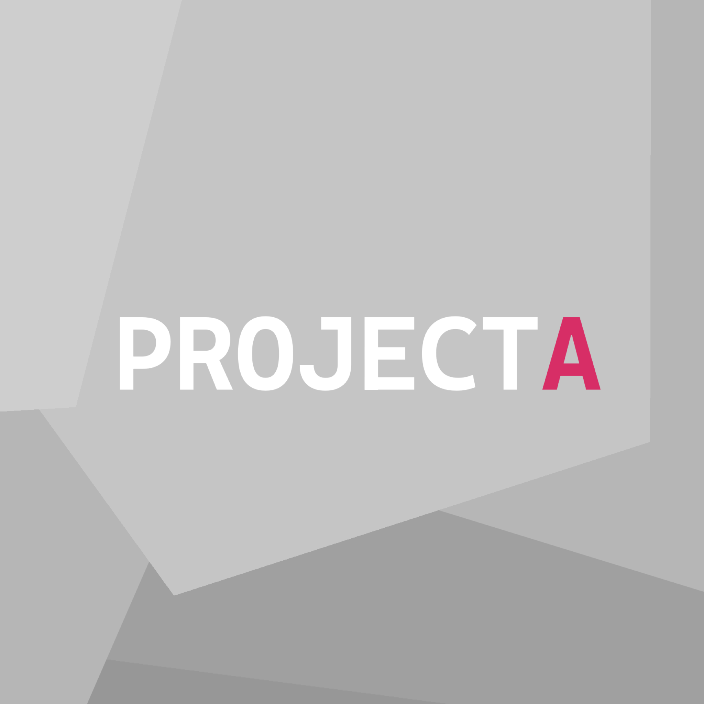

<h1>Project A</h1>
A simple mobile game originally created and published on Google Play to prevent expiration of my developer account.
The project is based on a free template from the Unity Asset Store "Bullet Master 3D" and has since been expanded with custom assets and improvements.

The purpose of this archive is to preserve and maintain this game in a playable state on a modern version of the Unity engine.

Main goals of this repository:
* Preserving the project as a milestone of my early development journey.
* Keeping the game functional on newer versions of Unity and Android devices.
* Fixing small bugs and making adjustments for better gameplay experience.
* Introducing custom visual identity to replace stock assets.
* Creating new levels to expand gameplay variety.
* Continuing development through regular updates and improvements.

📲 Available on Google Play:
https://play.google.com/store/apps/details?id=com.darkezowsky.projecta&hl=pl
